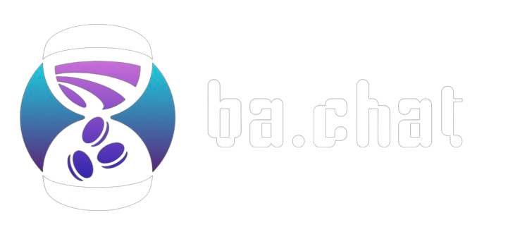

    
  &nbsp;&nbsp;&nbsp;  
     
  &nbsp;&nbsp;&nbsp;
  
  
  &nbsp;&nbsp;&nbsp;

<h1 align="center">ba.chat</h1>

<strong>Basics, Affordable:</strong> Making insurance and healthcare simpler, one chat at a time!

Time is money. We save both. ba.chat was motivated with the idea that healthcare, a _basic_ human right, should be made _affordable_. Insurance stress? Chat with our personalized assistant and find the best path to maximize your insurance benefits and get better!

### Our super-easy-to-use pipeline:
1. Upload your insurance provider, location, email address, and most recent diagnosis into their designated areas.
2. Simply click on the service you seek from the options provided:
   1. Analyze the cost of treatment and all deductibles based on your plan.
   2. Obtain contact information for the best treatment and hospitals in your vicinity - balanced for a blend of affordability and premium care.
   3. Craft a convincing email to your healthcare provider, underlining terms in your policy that the average user would gloss over. Maximize your benefits!
   4. Check for potential medical error: Medical errors are the [third leading cause of death in America](https://wilsonlaw.com/fatal-medical-errors/), and ba.chat cross-references the depths of medical resources to ensure you are not put in danger.
3. Receive a response tailored to your specifications exactly, and chat with our friendly AI to get more information!
4. Ask ba.chat to send an email to your healthcare provider to negotiate costs or hospitals near you to schedule appointments! Using a nifty Gmail integration, we simplify the process for you end-to-end. 

<strong>ba.chat is the only platform you need to use for the entire process!</strong>

